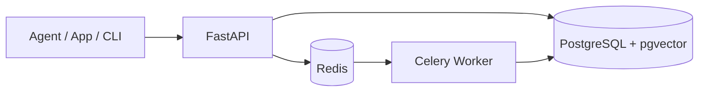
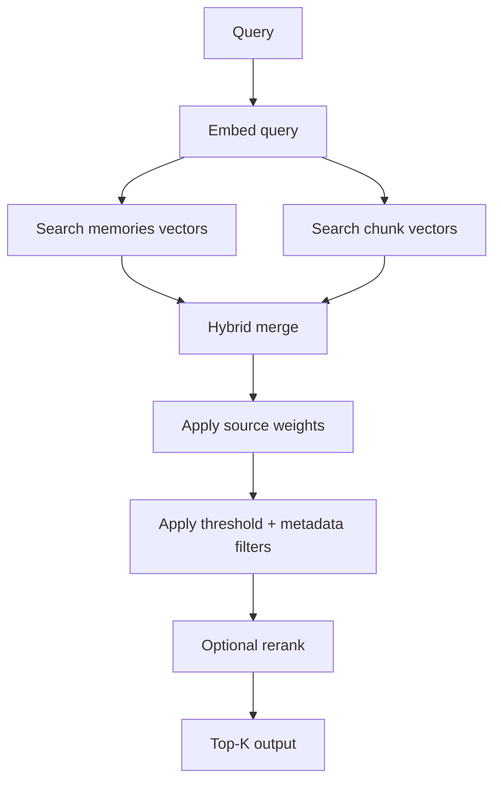
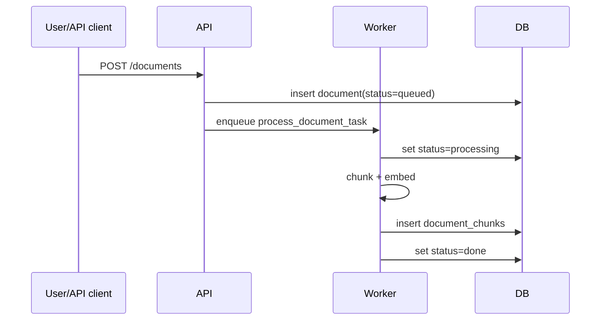

# Architecture Diagrams

## High-level

```mermaid
flowchart LR
  Client[Agent / App / CLI] --> API[FastAPI]
  API --> DB[(PostgreSQL + pgvector)]
  API --> Redis[(Redis)]
  Redis --> Worker[Celery Worker]
  Worker --> DB
```

## Retrieval pipeline

```mermaid
flowchart TD
  Q[Query] --> E[Embed query]
  E --> M[Search memories vectors]
  E --> C[Search chunk vectors]
  M --> H[Hybrid merge]
  C --> H
  H --> W[Apply source weights]
  W --> F[Apply threshold + metadata filters]
  F --> R[Optional rerank]
  R --> O[Top-K output]
```

## Document ingestion pipeline

```mermaid
sequenceDiagram
  participant U as User/API client
  participant A as API
  participant W as Worker
  participant D as DB

  U->>A: POST /documents
  A->>D: insert document(status=queued)
  A->>W: enqueue process_document_task
  W->>D: set status=processing
  W->>W: chunk + embed
  W->>D: insert document_chunks
  W->>D: set status=done
```
